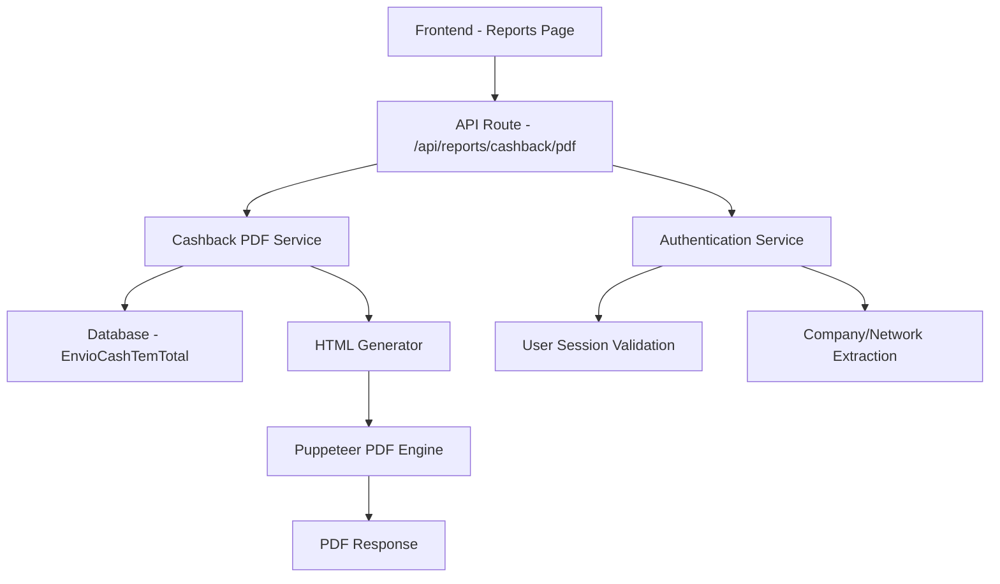

# Design Document - Cashback PDF Report

## Overview

This document outlines the technical design for implementing a PDF report generation feature for cashback data. The system will follow the established patterns from the existing birthday report system, utilizing Puppeteer for PDF generation and maintaining the same authentication and data filtering mechanisms.

The feature will generate professional PDF reports from the `EnvioCashTemTotal` table, filtered by user's company/network and optional date ranges, with customizable field selection.

## Architecture

### High-Level Architecture



### Data Flow

1. **User Interaction**: User selects fields and clicks "Ver" button on cashback report card
2. **Request Processing**: Frontend sends POST request with selected fields and optional date filters
3. **Authentication**: System validates user session and extracts company/network information
4. **Data Retrieval**: Service queries `EnvioCashTemTotal` table with appropriate filters
5. **HTML Generation**: System creates formatted HTML report with selected data
6. **PDF Generation**: Puppeteer converts HTML to PDF with professional styling
7. **Response**: PDF file is returned to user for download/viewing

## Components and Interfaces

### 1. API Route (`/api/reports/cashback/pdf/route.ts`)

**Purpose**: Main endpoint for PDF generation requests

**Interface**:
```typescript
// Request Body
interface CashbackPDFRequest {
  selectedFields: string[]
  startDate?: string
  endDate?: string
}

// Response
interface CashbackPDFResponse {
  // PDF binary data with appropriate headers
  // OR HTML fallback if Puppeteer fails
}
```

**Responsibilities**:
- Request validation
- User authentication via session cookies
- Coordinate with service layer
- Handle errors and fallbacks
- Return PDF with proper headers

### 2. Cashback PDF Service (`lib/cashback-pdf-service.ts`)

**Purpose**: Core business logic for PDF generation

**Interface**:
```typescript
interface CashbackPDFFilters {
  selectedFields: string[]
  startDate?: string
  endDate?: string
  userNetwork: string
}

interface CashbackReportData {
  Nome?: string
  Whatsapp?: string
  Loja?: string
  Rede_de_loja?: string
  Envio_novo?: string
  Status?: string
  [key: string]: any
}

export async function generateCashbackPDF(filters: CashbackPDFFilters): Promise<Buffer>
export async function getCashbackReportData(filters: CashbackPDFFilters): Promise<CashbackReportData[]>
export function generateReportHTML(data: CashbackReportData[], selectedFields: string[]): string
```

**Responsibilities**:
- Data retrieval from database
- HTML report generation
- PDF creation via Puppeteer
- Error handling and logging

### 3. Database Integration

**Table**: `EnvioCashTemTotal`
```sql
CREATE TABLE public."EnvioCashTemTotal" (
  "Nome" text null,
  "Whatsapp" text null,
  "Loja" text null,
  "Rede_de_loja" text null,
  "Envio_novo" date null default now(),
  "Status" text null,
  id uuid not null default gen_random_uuid(),
  constraint EnvioCashTemTotal_pkey primary key (id)
)
```

**Query Pattern**:
- Filter by `Status = 'Enviada'` (only sent messages)
- Filter by `Rede_de_loja = userNetwork` (user's company)
- Optional date range filtering on `Envio_novo`
- Select only requested fields

### 4. Frontend Integration

**Component**: Report card in `/reports` page

**Interface**:
```typescript
interface CashbackReportCard {
  selectedFields: string[]
  onGeneratePDF: (fields: string[], dateRange?: DateRange) => void
}
```

**Behavior**:
- Display checkboxes for available fields
- "Rede" field always checked and disabled
- Date range picker (optional)
- "Ver" button triggers PDF generation
- Loading state during generation
- Error handling and user feedback

## Data Models

### Field Mapping

The system will map database fields to user-friendly labels:

```typescript
const FIELD_LABELS: Record<string, string> = {
  'Nome': 'Nome',
  'Whatsapp': 'WhatsApp',
  'Loja': 'Loja',
  'Rede_de_loja': 'Rede',
  'Envio_novo': 'Data de Envio',
  'Status': 'Status'
}
```

### Data Processing

1. **Raw Data**: Retrieved from database with selected fields only
2. **Filtered Data**: Company-filtered and date-filtered records
3. **Formatted Data**: Dates formatted to Brazilian format (DD/MM/YYYY)
4. **HTML Data**: Escaped for HTML safety while preserving accents

### Authentication Model

Following the established pattern from birthday reports:

```typescript
interface AuthenticatedUser {
  id: string
  email: string
  nome?: string
  empresa?: string
  rede?: string
  sistema: string
}
```

**Authentication Flow**:
1. Extract `ps_session` cookie
2. Parse email from session value
3. Query `users` table for complete user data
4. Validate user belongs to "Praise Shot" system
5. Extract company/network (prioritize `rede` over `empresa`)

## Error Handling

### Error Categories

1. **Authentication Errors** (401)
   - Missing session cookie
   - Invalid session
   - User not found
   - User without company/network

2. **Validation Errors** (400)
   - Missing selected fields
   - Invalid date formats
   - Empty field selection

3. **Database Errors** (500)
   - Connection failures
   - Query errors
   - Data retrieval issues

4. **PDF Generation Errors** (500)
   - Puppeteer initialization failures
   - HTML to PDF conversion errors
   - Memory/resource constraints

### Error Handling Strategy

```typescript
// Graceful degradation for PDF generation
try {
  return await generatePDFWithPuppeteer(html)
} catch (puppeteerError) {
  console.error('Puppeteer failed, falling back to HTML:', puppeteerError)
  return generateHTMLResponse(html)
}
```

### Logging Strategy

Comprehensive logging at each stage:
- Request parameters
- Authentication details
- Data retrieval metrics
- PDF generation status
- Error details with stack traces

## Testing Strategy

### Unit Tests

1. **Service Layer Tests**
   - Data retrieval with various filters
   - HTML generation with different field combinations
   - Field mapping and formatting
   - Error handling scenarios

2. **API Route Tests**
   - Authentication validation
   - Request parameter validation
   - Response format verification
   - Error response handling

### Integration Tests

1. **Database Integration**
   - Query execution with real data
   - Filter application verification
   - Performance with large datasets

2. **PDF Generation**
   - Puppeteer integration
   - HTML to PDF conversion
   - File size and quality validation

3. **End-to-End Tests**
   - Complete user workflow
   - Frontend to backend integration
   - Error scenarios and recovery

### Performance Tests

1. **Load Testing**
   - Multiple concurrent PDF generations
   - Large dataset handling
   - Memory usage monitoring

2. **Scalability Testing**
   - Database query performance
   - Puppeteer resource management
   - Response time benchmarks

## Security Considerations

### Data Access Control

- **Company Isolation**: Strict filtering by user's company/network
- **Session Validation**: Robust authentication via session cookies
- **SQL Injection Prevention**: Parameterized queries only
- **Data Sanitization**: HTML escaping for output safety

### PDF Security

- **Content Security**: No external resources in generated PDFs
- **File Size Limits**: Reasonable limits to prevent resource exhaustion
- **Temporary File Cleanup**: Proper cleanup of any temporary files

### Privacy Protection

- **Data Minimization**: Only selected fields included in reports
- **Access Logging**: Audit trail for report generation
- **Secure Transmission**: HTTPS for all communications

## Performance Optimizations

### Database Optimizations

- **Indexed Queries**: Ensure proper indexes on filter columns
- **Field Selection**: Query only requested fields
- **Connection Pooling**: Efficient database connection management

### PDF Generation Optimizations

- **Puppeteer Configuration**: Optimized browser settings
- **Memory Management**: Proper browser cleanup
- **Concurrent Limits**: Prevent resource exhaustion

### Caching Strategy

- **Static Assets**: Cache CSS and styling resources
- **Template Caching**: Reuse HTML templates where possible
- **Connection Reuse**: Maintain database connections efficiently

## Deployment Considerations

### Dependencies

- **Puppeteer**: Requires Chrome/Chromium installation
- **System Resources**: Adequate memory for PDF generation
- **File System**: Temporary space for PDF processing

### Environment Configuration

```typescript
// Required environment variables
NEXT_PUBLIC_SUPABASE_URL
SUPABASE_SERVICE_ROLE_KEY
PUPPETEER_EXECUTABLE_PATH (optional)
```

### Monitoring

- **Error Tracking**: Comprehensive error logging
- **Performance Metrics**: Response time monitoring
- **Resource Usage**: Memory and CPU monitoring
- **Success Rates**: PDF generation success tracking