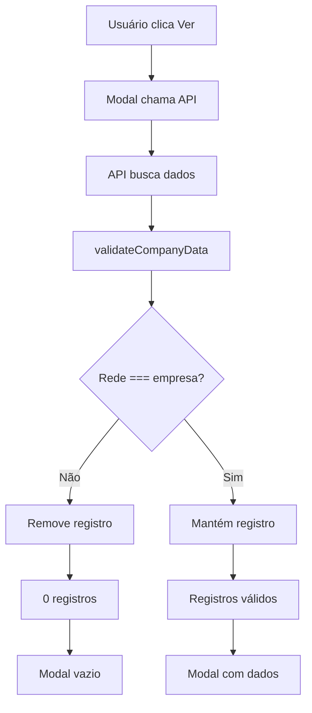
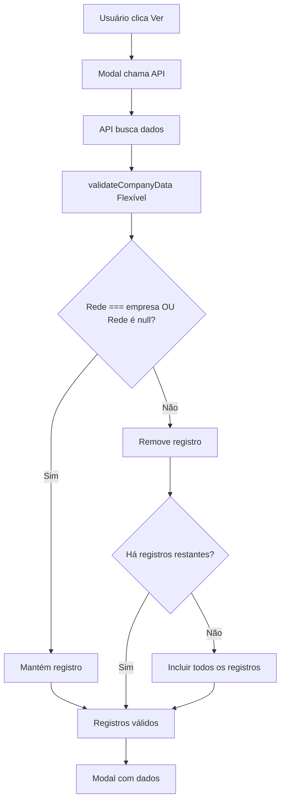

# Design Document - Correção do Filtro de Empresa em Promoções

## Overview

O problema identificado é que o sistema está filtrando dados por empresa de forma muito restritiva, removendo registros com campo 'Rede' null/undefined. Precisamos tornar o filtro mais flexível para incluir esses registros.

## Architecture

### Problema Atual
```
Usuário: empresa = 'temtotal'
Registro: Rede = undefined
Resultado: Registro removido (0 dados)
```

### Solução Proposta
```
Usuário: empresa = 'temtotal'
Registro: Rede = undefined
Resultado: Registro incluído (dados mostrados)
```

## Components and Interfaces

### 1. PromotionsReportService
**Arquivo:** `lib/promotions-report-service.ts`

**Mudanças:**
- Modificar `validateCompanyData()` para ser mais flexível
- Adicionar opção de incluir registros com Rede null/undefined
- Melhorar logs para debug

### 2. API Route
**Arquivo:** `app/api/reports/promotions/route.ts`

**Mudanças:**
- Adicionar logs mais detalhados sobre filtros
- Implementar fallback quando não há empresa definida
- Melhorar tratamento de erros

### 3. Modal Component
**Arquivo:** `components/ui/promotions-preview-modal.tsx`

**Mudanças:**
- Melhorar tratamento quando não há dados
- Adicionar mensagens mais claras para o usuário
- Implementar retry automático em caso de erro

## Data Models

### PromotionsReportFilters (Atualizado)
```typescript
interface PromotionsReportFilters {
  empresa: string
  selectedFields: string[]
  startDate?: string
  endDate?: string
  includeNullCompany?: boolean  // NOVO: incluir registros sem empresa
}
```

### CompanyValidationOptions (Novo)
```typescript
interface CompanyValidationOptions {
  strictMode: boolean           // Se true, filtra rigorosamente por empresa
  includeNull: boolean         // Se true, inclui registros com Rede null
  includeEmpty: boolean        // Se true, inclui registros com Rede vazia
  fallbackToAll: boolean       // Se true, mostra todos se não encontrar da empresa
}
```

## Error Handling

### Cenários de Erro
1. **Nenhum dado encontrado para empresa específica**
   - Tentar incluir registros com Rede null
   - Se ainda não houver dados, mostrar todos os registros
   - Logar claramente o que foi feito

2. **Campo Rede inconsistente**
   - Aceitar null, undefined, string vazia
   - Logar quantos registros de cada tipo foram encontrados

3. **Erro de conexão com Supabase**
   - Retry automático
   - Mensagem clara para o usuário

## Testing Strategy

### Testes Unitários
1. `validateCompanyData()` com diferentes cenários:
   - Registros com Rede válida
   - Registros com Rede null
   - Registros com Rede undefined
   - Registros com Rede vazia
   - Mistura de registros válidos e inválidos

### Testes de Integração
1. API com diferentes empresas de usuário
2. Modal com diferentes cenários de dados
3. Fluxo completo: página → modal → dados

### Testes Manuais
1. Testar com usuário da empresa 'temtotal'
2. Testar com usuário sem empresa definida
3. Testar com dados mistos na tabela

## Implementation Plan

### Fase 1: Correção Imediata
1. Modificar `validateCompanyData()` para incluir registros null
2. Adicionar logs detalhados
3. Testar com dados atuais

### Fase 2: Melhorias
1. Implementar opções de validação flexível
2. Melhorar UX do modal
3. Adicionar testes automatizados

### Fase 3: Otimização
1. Cache inteligente baseado em empresa
2. Pré-carregamento de dados
3. Métricas de uso

## Mermaid Diagrams

### Fluxo Atual (Problemático)


### Fluxo Proposto (Corrigido)


## Security Considerations

- Manter validação de autenticação
- Logar acessos para auditoria
- Não expor dados de outras empresas quando houver empresa definida
- Permitir acesso a dados "órfãos" (sem empresa) apenas quando necessário

## Performance Considerations

- Manter limite de 1000 registros
- Cache baseado em filtros aplicados
- Índices no banco para campos de filtro
- Paginação no modal para grandes volumes