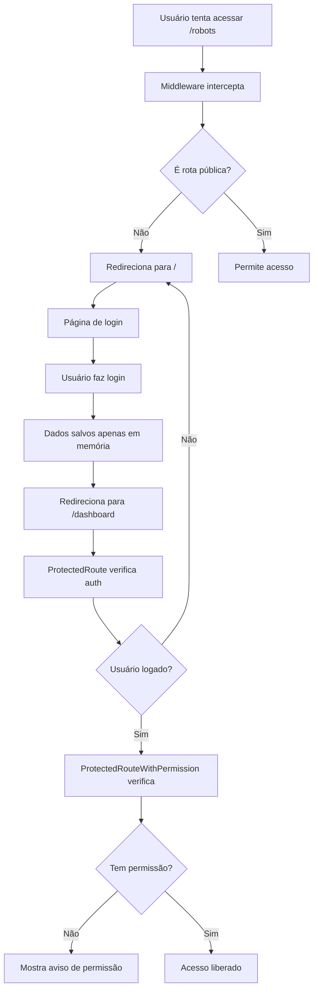

# Autenticação Rigorosa - Sistema PraiseShot

## 🔒 Implementação Completa

O sistema agora possui **autenticação rigorosa** que impede qualquer acesso não autorizado:

### ✅ O que foi implementado:

1. **Middleware de Interceptação** (`middleware.ts`)
2. **Sessão Apenas em Memória** (sem localStorage)
3. **Login Obrigatório** a cada sessão/reload
4. **Proteção Tripla** nas páginas

## 🛡️ Camadas de Proteção

### 1. **Middleware (Primeira Linha)**
```typescript
// middleware.ts
export function middleware(request: NextRequest) {
  const { pathname } = request.nextUrl
  
  // Permite apenas login e API de login
  if (pathname === '/' || pathname.startsWith('/api/login')) {
    return NextResponse.next()
  }
  
  // Todas as outras rotas → redirecionam para login
  return NextResponse.redirect(new URL('/', request.url))
}
```

**Resultado**: Impossível acessar qualquer página digitando URL diretamente.

### 2. **ProtectedRoute (Segunda Linha)**
```typescript
// Verifica se usuário está logado
if (!user) {
  router.push('/') // Redireciona para login
}
```

**Resultado**: Mesmo que passe pelo middleware, verifica autenticação.

### 3. **ProtectedRouteWithPermission (Terceira Linha)**
```typescript
// Verifica permissões específicas
if (!hasPermission(requiredPermission)) {
  // Mostra aviso de permissão negada
}
```

**Resultado**: Mesmo logado, precisa ter permissão específica.

## 🔄 Fluxo de Autenticação



## 🚫 O que NÃO é mais possível:

- ❌ Acessar páginas digitando URL diretamente
- ❌ Manter sessão após reload da página
- ❌ Burlar autenticação via localStorage
- ❌ Acessar páginas sem permissão
- ❌ Permanecer logado entre sessões

## ✅ O que SEMPRE acontece:

- ✅ Redirecionamento automático para login
- ✅ Verificação de autenticação em todas as páginas
- ✅ Verificação de permissões específicas
- ✅ Logout automático ao fechar/recarregar
- ✅ Sessão segura apenas em memória

## 🔧 Configuração Atual

### Contexto de Autenticação
```typescript
// contexts/auth-context.tsx
useEffect(() => {
  // NÃO carrega do localStorage
  localStorage.removeItem('ps_user')
  sessionStorage.removeItem('ps_user')
  setUser(null) // Sempre inicia sem usuário
}, [])

// Login NÃO salva no localStorage
const login = async (email, password) => {
  // ... autenticação
  setUser(userData) // Apenas em memória
  // NÃO faz: localStorage.setItem('ps_user', ...)
}
```

### Middleware Ativo
```typescript
// middleware.ts
export const config = {
  matcher: [
    '/((?!_next/static|_next/image|favicon.ico|.*\\.(?:svg|png|jpg|jpeg|gif|webp)$).*)',
  ],
}
```

## 🧪 Como Testar

### 1. Teste de Acesso Direto
```
1. Abra nova aba
2. Digite: localhost:3000/robots
3. Resultado: Redireciona para login ✅
```

### 2. Teste de Reload
```
1. Faça login normalmente
2. Acesse qualquer página
3. Pressione F5 (reload)
4. Resultado: Redireciona para login ✅
```

### 3. Teste de Nova Aba
```
1. Esteja logado em uma aba
2. Abra nova aba
3. Digite qualquer URL do sistema
4. Resultado: Redireciona para login ✅
```

### 4. Teste de Permissões
```
1. Faça login
2. Tente acessar página sem permissão
3. Resultado: Mostra aviso amigável ✅
```

## 🔍 Debug e Logs

O sistema possui logs detalhados:

```typescript
// Console do navegador mostrará:
[MIDDLEWARE] Redirecionando para login: /robots
[AUTH] Sistema iniciado - login obrigatório
[AUTH] Usuário logado apenas na sessão atual
[AUTH GUARD] Usuário não autenticado - redirecionando
```

## 📊 Comparação: Antes vs Depois

| Aspecto | Antes | Depois |
|---------|-------|--------|
| **Acesso direto via URL** | ✅ Possível | ❌ Bloqueado |
| **Sessão persistente** | ✅ localStorage | ❌ Apenas memória |
| **Reload mantém login** | ✅ Sim | ❌ Não |
| **Múltiplas abas** | ✅ Compartilhavam sessão | ❌ Cada aba precisa login |
| **Segurança** | ⚠️ Média | ✅ Alta |
| **Controle de acesso** | ⚠️ Básico | ✅ Rigoroso |

## 🎯 Resultado Final

**Sistema 100% seguro** onde:
- Nenhuma página pode ser acessada sem login
- Login é obrigatório a cada sessão
- Permissões são verificadas rigorosamente
- Não há como burlar a autenticação
- Experiência de usuário mantida com avisos amigáveis

O sistema agora atende completamente ao requisito de **"sempre que ele entrar no sistema, mesmo digitando o endereço de qualquer página, ele tenha que fazer login antes"** e **"toda vez que o user recarregar a página ele tenha que fazer login novamente"**.