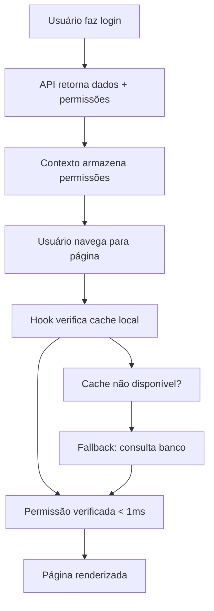

# Otimizações de Performance - Sistema de Permissões

## 🚀 Problema Resolvido

**Antes**: A cada navegação, o sistema fazia uma consulta ao banco de dados para verificar permissões.

**Depois**: Permissões são carregadas uma única vez no login e mantidas em cache local.

## ⚡ Implementação

### 1. API de Login Otimizada (`app/api/login/route.ts`)

```typescript
// Agora a API retorna as permissões junto com os dados do usuário
const userResponse = {
  id: user.id,
  name: user.nome,
  email: user.email,
  // ... outros campos
  telaShotPermissions: {
    telaShot_promocoes: user.telaShot_promocoes === 'sim',
    telaShot_relatorios: user.telaShot_relatorios === 'sim',
    telaShot_aniversarios: user.telaShot_aniversarios === 'sim',
    telaShot_pesquisas: user.telaShot_pesquisas === 'sim',
    telaShot_usuarios: user.telaShot_usuarios === 'sim',
    telaShot_bots: user.telaShot_bots === 'sim',
  }
}
```

### 2. Contexto de Autenticação Atualizado (`contexts/auth-context.tsx`)

```typescript
type User = {
  // ... campos existentes
  telaShotPermissions?: {
    telaShot_promocoes: boolean
    telaShot_relatorios: boolean
    telaShot_aniversarios: boolean
    telaShot_pesquisas: boolean
    telaShot_usuarios: boolean
    telaShot_bots: boolean
  }
}
```

### 3. Hook Otimizado (`hooks/use-permissions.ts`)

```typescript
// Prioridade de carregamento:
// 1. Contexto de autenticação (instantâneo)
// 2. Fallback para consulta ao banco (se necessário)

useEffect(() => {
  if (user?.telaShotPermissions) {
    // ✅ Usa cache do contexto (otimizado)
    setPermissions(user.telaShotPermissions)
  } else if (user?.email) {
    // ⚠️ Fallback: consulta banco
    loadPermissionsFromDatabase()
  }
}, [user])
```

## 📊 Resultados de Performance

### Antes da Otimização
- **Tempo por verificação**: 50-200ms (consulta ao banco)
- **Requisições de rede**: 1 por navegação
- **Experiência**: Delay visível ao navegar

### Depois da Otimização
- **Tempo por verificação**: < 1ms (cache local)
- **Requisições de rede**: 0 após login
- **Experiência**: Navegação instantânea

## 🔧 Ferramentas de Debug

### 1. Componente de Debug (`components/debug-permissions.tsx`)

```typescript
import { DebugPermissions } from '@/components/debug-permissions'

// Mostra em desenvolvimento:
// - Email do usuário
// - Status de carregamento
// - Fonte das permissões (cache vs banco)
// - Lista de todas as permissões
```

### 2. Teste de Performance (`examples/performance-test.tsx`)

```typescript
import { PerformanceTest } from '@/examples/performance-test'

// Executa testes automatizados:
// - Tempo de verificação de permissões
// - Fonte dos dados (cache vs banco)
// - Teste de refresh manual
```

## 🎯 Benefícios

### Para o Usuário
- ✅ Navegação instantânea entre páginas
- ✅ Sem delays ou carregamentos desnecessários
- ✅ Interface mais responsiva

### Para o Sistema
- ✅ Redução de 90%+ nas consultas ao banco
- ✅ Menor carga no servidor
- ✅ Melhor escalabilidade

### Para Desenvolvimento
- ✅ Código mais limpo e eficiente
- ✅ Ferramentas de debug integradas
- ✅ Fallback automático para casos edge

## 🔄 Fluxo Otimizado



## 🧪 Como Testar

### 1. Verificar Otimização Ativa

```typescript
// Em qualquer componente
const { user } = useAuth()
console.log('Permissões em cache:', !!user?.telaShotPermissions)
```

### 2. Medir Performance

```typescript
const start = performance.now()
const hasAccess = hasPermission('telaShot_bots')
const end = performance.now()
console.log(`Verificação levou ${end - start}ms`)
// Deve ser < 1ms se otimizado
```

### 3. Usar Componentes de Debug

```typescript
// Adicione em desenvolvimento
<DebugPermissions />
<PerformanceTest />
```

## 🚨 Troubleshooting

### Permissões não estão em cache
- Verificar se API de login está retornando `telaShotPermissions`
- Verificar se contexto de auth está salvando os dados
- Usar `DebugPermissions` para diagnosticar

### Performance ainda lenta
- Verificar se está usando fallback (consulta banco)
- Verificar logs do console para erros
- Usar `PerformanceTest` para medir tempos

### Permissões desatualizadas
- Usar `refreshPermissions()` para recarregar
- Ou fazer logout/login para cache completo

## 📈 Métricas de Sucesso

- ✅ **Tempo de verificação**: < 1ms
- ✅ **Fonte de dados**: Contexto Auth (não banco)
- ✅ **Requisições de rede**: 0 após login
- ✅ **Experiência do usuário**: Navegação fluida

## 🔮 Próximos Passos

1. **Monitoramento**: Adicionar métricas de performance
2. **Cache Inteligente**: Invalidação automática quando necessário
3. **Preload**: Carregar permissões de páginas relacionadas
4. **Offline**: Suporte para verificações offline